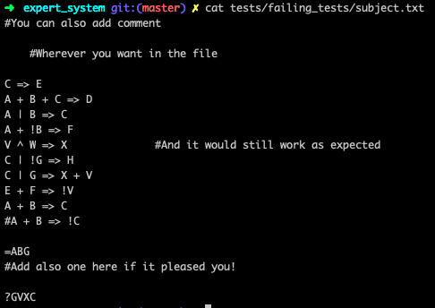

# Expert System

Expert System is a project as part of the 42 algorithmic curriculum.
The aim of this project is to build an expert system. It consists of a set of logical rules given as inputs,
as well as initial facts (line starting with the `=` sign) which are considered to be true.
Finally, the input file also contains a set of queries (line starting with the `?` sign) which are the element to be proved using the set of rules and initial facts.

### Input

The input is a .txt file containing the rules, initial facts and queries.
It has to be passed to the program as an argument (see the *Usage* section below).

Exemple of an input file :

